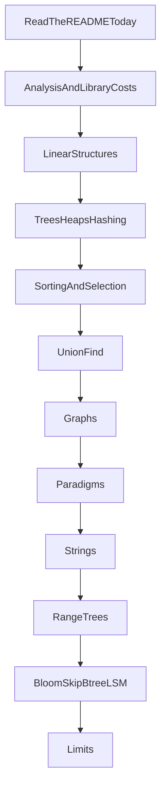

# Bits and Bytes curriculum

A study path for data structures and algorithms in this repository. It follows the textbooks and university courses listed below, then adds the costs that show up in production Python. This file is the plan. It does not add implementations.

Two orders are in force, and they are not the same:

* **Read now.** Follow [README.md](README.md). That is the only path that exists in the tree today. Analysis is not a module yet, so do not try to start at chapter 1.
* **Finished course.** The order in the second diagram, once the core rows of the gap list exist. The README is updated as those rows land. Until then the README is not a draft of this diagram.

## Status and tier

| Word | Meaning |
| --- | --- |
| **Present** | The operation is implemented and its `Cost` section derives the bound. A worked trace is not required for modules already in the tree. |
| **Partial** | An implementation exists, and a named piece of the usual treatment is still absent. Partial is not "done." |
| **Missing** | A learner cannot study this operation from the repository yet. |
| **Core** | Required implementation: docstring, invariant, one worked trace, `Cost` section, and tests for the empty case, the one-element case, and one case that distinguishes it from a nearby algorithm. |
| **Named** | Not implemented. A short note states the bound and the tool a professional would use instead. Named topics are not gap-list rows. |

"Complete" applies only to **Core**. For every Core topic a learner can implement it from the docstring, derive the cost, and say which textbook result it is. For every **Named** topic the learner can say why this course does not code it and what to reach for instead. A Named topic does not fail the course by staying uncoded.

New modules follow the Core bar, including the worked trace. Existing Present modules stay Present without a new trace. Adding traces to heapsort, the chaining table, the BST, and binary search is polish, listed once in the gap list, not a redefinition of Present.

## What this course refuses to absorb

Numerical linear algebra, the FFT, linear programming, cryptography, and a machine-learning course are named at the end so they are not mistaken for gaps. System design (capacity, replication, product APIs) is not this course. The structures those designs sit on are.

## Sources

The sequence is a synthesis, not a copy of one syllabus.

| Source | What it contributes | Decision when it conflicts |
| --- | --- | --- |
| Cormen, Leiserson, Rivest, Stein, *Introduction to Algorithms*, 4th ed., MIT Press, 2022 | Foundations, sorting and order statistics, trees, hashing, dynamic programming, greedy algorithms, amortization, union-find, graphs, matching, online algorithms. | Parallel algorithms and the machine-learning chapter stay adjacent fields. |
| MIT 6.006, Spring 2020 (OpenCourseWare; now numbered 6.1210) | One-term core: hashing, sorting, AVL trees, heaps, BFS, DFS, Bellman-Ford, Dijkstra, dynamic programming, complexity. | The coded balanced tree is not AVL. AVL is Named. The height bound is the same. |
| Princeton COS 226, Spring 2026, and Sedgewick & Wayne, *Algorithms*, 4th ed., 2011 | Union-find, symbol tables, red-black trees, chaining and linear probing, spanning trees, shortest paths, tries, substring search, compression. | k-d trees are Named under geometry. String LSD radix sort is Core, beside integer radix, because it is the same algorithm on another alphabet. |
| UC Berkeley CS 61B, Fall 2025 (Hug and Kao) | Asymptotics before cleverness, disjoint sets, 2-3 trees and left-leaning red-black trees, tries, the comparison lower bound, radix sort. | The coded balanced tree is a left-leaning red-black tree. The docstring teaches it as the binary encoding of a 2-3 tree. A separate 2-3 type is not coded. |
| Python language documentation, "Time complexity of operations on built-in types" | Costs of `list`, `dict`, `set`, and the advice to use `collections.deque` when both ends move. | The library-cost module is Core and is built immediately after the analysis note, not at the end. |
| Engineering interviews, 2024–2026 | Two pointers, sliding window, binary search including search on the answer, traversals, topological sort, union-find, heaps, prefix sums, backtracking. | One exercise per pattern, pointing at a module. Not a problem archive. B-trees, LSM-trees, and Bloom filters are Core. HNSW is Named. |

Dijkstra keeps two bounds. The O(V²) scan stays in the docstring as the version a binary heap replaces. The heap version is the Core bound, O((V + E) log V), for non-negative weights.

## How a Core module is written

* The module docstring states the idea, the invariant, and one worked trace.
* Every function has a `Cost` section that names the input size, counts the loops, multiplies by the work in the body, and separates extra memory from the input.
* Tests cover empty, one element, and one distinguishing case (stability, a negative edge, a duplicate key, a cycle).
* The README gains one bullet: file, idea, cost result. The algebra stays in the docstring.
* New families get a package (`strings/`, `dynamic_programming/`). Paths stay importable.

## Finished-course order

This order is the target. It is not the README.

Union-find sits before graphs because Kruskal is a client, not a prerequisite. Library costs sit beside analysis because `list.pop(0)` is the first production bug the analysis chapter names. Range trees do not depend on graphs. Storage structures depend on the Bloom filter and on a balanced tree or a skip list, so they come after both exist.

---

## 0. How to study what is already here

**Present**, as a convention.

* Follow the README. Then read the module docstring, the `Cost` section, and the tests.
* Re-derive one bound before reading it: bubble sort's `n(n - 1) / 2`, or the claim that a monotonic stack is O(n) because each index is pushed and popped once.
* Several list algorithms are O(1) extra memory after `require_linear` returns, and O(n) while that guard holds its `seen` set. Peak and the memory of the result are different numbers.

---

## 1. Analysis

**Core, Missing** as a module. CLRS part I, MIT lecture 1, CS 61B asymptotics. The vocabulary module is `bitsandbytes/complexity.py` (Present).

The cost model is the **word RAM**: a pointer write, a comparison, a hash of a fixed-size key, and an arithmetic operation on a machine word are each one step. That model is an assumption. CPython integers grow without a fixed width, so a Fibonacci number with Θ(n) bits is not O(1) to add. Any Core dynamic program whose values do not fit in a word says so, and the required Fibonacci implementation reduces modulo a fixed word so the model holds. Unbounded Python integers are a note, not the measured bound.

Python does not perform tail-call elimination. The default recursion limit is 1000. Recursive reverse already records an O(n) call stack. Memoized recursion is not the required form of a dynamic program. Bottom-up tables are. A memoized version, if shown, states the stack depth next to the time bound.

| Topic | Teach | Tier | Status |
| --- | --- | --- | --- |
| Word RAM, and where Python leaves it | The steps above. Big integers and the recursion limit. | Core | Present |
| O, Θ, Ω | Upper, tight, and lower bounds. Use Θ when the section has a sum such as `n(n - 1) / 2`. | Core | Present |
| Best, typical, worst | The house style when they differ. | Core | Present as a habit |
| Recurrences | `T(n) = 2T(n/2) + O(n)`, `T(n) = T(n/2) + O(1)`, `T(n) = T(n - 1) + O(n)`. Substitution and a recursion tree. Akra–Bazzi is out of scope. | Core | Partial, inside merge sort and quick sort |
| Amortized cost | Aggregate analysis of geometric growth. The potential method is Named, used in print for splay trees. | Core for the aggregate argument | Partial, inside `Stack.push` |
| Randomized expectation | Random-pivot quick sort is expected O(n log n) on distinct keys. All-equal Lomuto stays O(n²). | Core | Partial, in `quick_sort.py` |
| Loop invariants | One sentence. Floyd, the histogram stack, and shunting-yard already have traces. | Core as a habit | Partial |

**Library costs are part of this chapter, not a late appendix.** The incident "the algorithm is quadratic" is usually `x in some_list` inside a loop, or `list.pop(0)` used as a queue. The Core module `bitsandbytes/library_costs.py` does not reimplement CPython. It uses `collections.deque`, `heapq`, and `bisect` for a queue, a top-k, and insertion into a sorted list, and each function's `Cost` section cites the library operation. Facts to state, from the language documentation:

| Object | Fact |
| --- | --- |
| `list` | `append` and `pop()` at the end are amortized O(1). `insert(0, x)` and `pop(0)` are O(n). Indexing is O(1). |
| `collections.deque` | O(1) at both ends. This is the queue for breadth-first search. CPython stores blocks, not one node per element. |
| `dict` and `set` | Average O(1) lookup, insert, and delete when hashes spread out. Worst case O(n). Since 3.7, `dict` preserves insertion order. CPython randomizes hashes so a caller cannot cheaply force one bucket. The teaching table demonstrates a bad hash inside this process. It is not a recipe for attacking another service. |
| `heapq` | Min-heap. `heappush` and `heappop` are O(log n). `heapify` is O(n). |
| `bisect` | Binary search on a sorted `list`, O(log n). |
| `list.sort` | Timsort, O(n log n), stable, adaptive on partially sorted runs. |

**Suggested shape.** One module, `bitsandbytes/complexity.py`, for the vocabulary and the three recurrences, plus `library_costs.py`. The recurrence helper classifies those three shapes. It is not a solver for arbitrary recurrences.

**Library costs** live in `bitsandbytes/library_costs.py` (Present).

---

## 2. Linear structures

CLRS chapter 10. Most of this chapter exists. Do not add another dozen linked-list puzzles.

| Topic | Cost to derive | Tier | Status | Where |
| --- | --- | --- | --- | --- |
| Singly linked list, cached tail | `append` O(1); `node_at` and tail `pop` O(n) | Core | Present | `linked_list.py` |
| List algorithms already in `linked_lists/` | As in the README | Core | Present | `linked_lists/` |
| Doubly linked list | Unlink given the node is O(1) | Core | Present | `doubly_linked_list.py` |
| Stack, bounded and unbounded | Amortized O(1) `push`; O(1) `pop` | Core | Present | `stacks/stack.py`, `algorithm_stack.py` |
| Stack applications | O(n) monotonic scans; O(n²) stack sort | Core | Present | `stacks/` |
| Queue on a doubly linked list | O(1) enqueue and dequeue | Core | Present | `queues/linked_queue.py` |
| Circular buffer | O(1), with an explicit size so full and empty differ | Core | Present | `queues/circular_queue.py` |
| Deque | O(1) at both ends; O(n) in the middle | Core | Present | `deques/linked_deque.py` |
| Dynamic array | n appends copy O(n) elements in total under geometric growth | Core | Present | `linear/dynamic_array.py` |
| Recursion and the call stack | Recursive reverse is O(n) stack. Python does not perform tail-call elimination. | Core | Present | `linked_lists/reverse.py` |

---

## 3. Trees, heaps, and hashing

MIT lectures 4 and 6–8, CLRS chapters 6 and 11–13, Princeton symbol tables, Berkeley's 2-3 / red-black sequence.

| Topic | Cost to derive | Tier | Status | Notes |
| --- | --- | --- | --- | --- |
| Traversals: preorder, inorder, postorder, level order | O(n) time. O(h) stack, or O(n) queue for levels. | Core | Present | `trees/traversals.py` and BST inorder |
| Binary search tree, including deletion | O(h) search, insert, and delete. Sorted insertion makes h = n. | Core | Present | `trees/bst.py` |
| Left-leaning red-black tree | O(log n) height after every insert and delete. | Core | Missing | This is the one balanced tree the course codes. The docstring derives it as a 2-3 tree stored in binary nodes. AVL is Named: MIT's lecture tree, same height bound, different rotations. A separate 2-3 type is not coded. |
| Order-statistic tree | Rank and select in O(log n) once subtree sizes sit on the red-black nodes. | Core | Missing | One augmentation of the tree above, not a second species. |
| Binary heap as a priority queue | `heapify` is O(n). Push and pop are O(log n). | Core | Present | `heaps/priority_queue.py` and `heapsort.py` |
| `decrease-key` | O(log n) with an index map from the item to its heap slot. A linear scan is O(n) and does not earn the Dijkstra bound below. | Core | Present | `heaps/priority_queue.py` |
| Heapsort | O(n log n) time, O(1) extra memory, not stable. | Core | Present | `heapsort` |
| Separate chaining | Expected O(1) lookup. O(n) when the table doubles and rehashes. | Core | Present | `hash_tables/chaining.py` |
| Linear probing | Expected O(1) while the load factor stays bounded away from 1. Clustering is the story. Tombstones on delete. | Core | Present | `hash_tables/linear_probing.py` |
| A degenerate hash | One bucket of length n, so the expected bound is false. | Core | Present | `degenerate_chain_length` in `linear_probing.py` |

Fibonacci heaps are Named. They improve Dijkstra's comparison bound in the textbook and are not what libraries ship. Splay trees are Named: amortized O(log n), no extra code.

The LRU cache is a hash table plus an order list. Say that again when this chapter is reread. The cache itself lives in `linked_lists/lru_cache.py` and is Present.

---

## 4. Sorting and selection

CLRS part II, MIT lectures 3 and 5, Berkeley's sorting block.

| Topic | Cost to derive | Tier | Status |
| --- | --- | --- | --- |
| Bubble, selection, insertion | Quadratic. Insertion is O(n) on sorted input. Bubble and insertion are stable. Selection is not. | Core | Present |
| Merge sort | `T(n) = 2T(n/2) + O(n) = O(n log n)`. O(n) extra memory. Stable. | Core | Present, on arrays and on lists |
| Quick sort, Lomuto and three-way | Expected O(n log n) on distinct keys. All-equal Lomuto is O(n²). Three-way split repairs that case. Not stable. Lomuto needs `<=`, so a stability test has to be written with a type that defines it. | Core | Present |
| Heapsort | Chapter 3 | Core | Present |
| Comparison lower bound | `log2(n!)` is about `n log n` comparisons. | Core | Present |
| Counting sort, integer radix, LSD string radix | O(n + k) and O(d(n + k)). The lower bound does not apply. LSD is the same pass on a string alphabet of fixed width. MSD is Named. | Core | Present |
| Quickselect | Expected O(n). Worst-case linear selection (median of medians) is Named: the bound is the lesson, the constant factor is not worth the code. | Core for the expected algorithm | Present |
| Binary search, lower bound, upper bound | `T(n) = T(n/2) + O(1) = O(log n)` | Core | Present |
| Binary search on the answer | The search space is a numeric range. Each probe is a monotonic predicate. | Core | Present |
| Inversion count | Merge sort, plus a count of pairs that cross the midpoint. | Core | Present |
| Stability tests | Bubble, insertion, and merge have tests. Selection has a test that equal keys do not keep their original order. | Core | Present for quick sort's label test |

Timsort, already in chapter 1, is the production sort. Integer or string radix is for keys that are digits. Quickselect is for "the k-th" without sorting the rest.

---

## 5. Union-find

CLRS's disjoint-set chapter, Princeton's percolation, Berkeley's disjoint sets. It is its own chapter so Kruskal cannot be assigned first.

| Topic | Cost to derive | Tier | Status |
| --- | --- | --- | --- |
| Union by rank and path compression | Treated as effectively constant per operation (inverse Ackermann). The code also shows the tree without those heuristics, so the worse bound has a program to point at. | Core | Present |
| Percolation | A grid of sites, unions between open neighbors, connectivity queried at the two ends. | Core | Present |

---

## 6. Graphs

MIT lectures 9–14 and CLRS's graph part. The package today is a directed adjacency list, a DFS order, a BFS order, and a Dijkstra that scans unsettled vertices.

| Topic | Cost to derive | Tier | Status |
| --- | --- | --- | --- |
| Adjacency lists | O(V + E) space. | Core | Present |
| Adjacency matrix | O(V²) space, O(1) edge test. | Named | The paragraph lives next to the list type. A second class is not required. |
| DFS and BFS orders | O(V + E) | Core | Present | `depth_first_order`, `breadth_first_order` |
| Undirected versus directed | The same walk with a different edge rule answers a different question. | Core | Present | `UndirectedGraph` in `graphs/algorithms.py` |
| Unweighted distances and parents | BFS order is the shortest-path order. The current function returns neither distances nor parents. | Core | Present | `bfs_distances_and_parents` |
| Cycle detection and topological sort | A back edge is a cycle. A DAG has a finishing-time order. O(V + E). | Core | Partial | Topological sort in `graphs/algorithms.py`; cycle detection still Missing |
| Connected components, and one strong-component algorithm | Kosaraju or Tarjan, not both. O(V + E). | Core | Partial | Undirected components in `connected_components`; strong components Missing |
| Weights stored on edges | `add_edge` already takes a weight. | Core | Present |
| Dijkstra, scan and heap | Scan is O(V² + E) and stays documented. Heap is O((V + E) log V) with the index map from chapter 3. Non-negative weights only. | Core | Present |
| Bellman-Ford | O(VE), and a negative cycle is detectable. This is why Dijkstra has a precondition. | Core | Present |
| Shortest paths in a DAG | One topological pass, O(V + E), negative weights allowed. | Core | Present |
| Prim | O((V + E) log V) with the heap. Cut property in one paragraph. | Core | Present |
| Kruskal | O(E log E) after sorting edges, using chapter 5. | Core | Present |
| Bipartite test | BFS 2-coloring, O(V + E). | Core | Present |
| 0-1 BFS | A deque, not a heap, when every weight is 0 or 1. | Core | Present |
| Floyd-Warshall | O(V³) time, O(V²) memory. | Core | Present |
| Maximum flow and bipartite matching | Ford-Fulkerson and Edmonds-Karp's O(VE²) bound. | Named | Most product code calls a solver. No flow implementation. |

Greedy is the right label for Dijkstra and Prim when chapter 7 is written.

---

## 7. Design paradigms

CLRS chapters on divide-and-conquer, dynamic programming, and greedy algorithms. Each Core problem exists to force one invariant. This is not a problem archive.

### 7.1 Divide and conquer

**Partial.** Merge sort, quick sort, and binary search are the examples. The inversion count in chapter 4 is the extra Core problem. Closest pair is Named, with computational geometry.

### 7.2 Dynamic programming

**Core, Missing.** Checklist: subproblems, a recurrence, an order that respects dependencies, and a bottom-up table. Memoized recursion is a comparison, not the required form, and it states its stack depth. The interpreter's recursion limit is part of that sentence.

| Problem | Bound to derive | Why it is here |
| --- | --- | --- |
| Fibonacci modulo a fixed word, naive versus bottom-up | Exponential calls versus O(n) word operations | Overlapping subproblems, inside the word-RAM model |
| Coin change (minimum coins) | O(amount × coins) time, O(amount) memory | The first hand-filled table |
| 0/1 knapsack | O(nW) time, and the one-row O(W) memory form | Pseudo-polynomial time, named as such |
| Longest common subsequence | O(nm) | The grid |
| Edit distance | O(nm) | The same grid, a different local choice |
| Longest increasing subsequence | O(n²), then O(n log n) with patience sorting | A table that a search structure improves |
| Linear DP with an adjacent constraint | O(n) | The smallest recurrence of this shape |
| One unbounded-knapsack or word-break | O(nW) or O(n · dictionary) | The coin pattern again |
| DP on a DAG | O(V + E) after topological sort | Uses chapter 6 |

Interval DP is Named (one sentence on matrix-chain order). Digit DP, tree DP, and bitmask DP are Named.

### 7.3 Greedy algorithms

**Core, Missing.** One exchange argument, and one counterexample where the greedy choice fails.

| Problem | Bound | Docstring obligation |
| --- | --- | --- |
| Interval scheduling | O(n log n) after sorting by finish time | The greedy choice stays optimal |
| Fractional knapsack | O(n log n) | The same choice fails for 0/1 knapsack |
| Huffman coding | O(n log n) with a heap | Compression, the Princeton client of the heap |

### 7.4 Backtracking

**Core, Missing.** Permutations, combinations, subsets, and N-queens. Derive the size of the recursion tree. An early reject does not change the worst-case tree. State the stack depth. Sudoku is Named.

### 7.5 Array patterns

**Missing.** These are not credited by the linked-list pointer walks in chapter 2. Those walks stay in chapter 2.

| Pattern | Bound | Tier |
| --- | --- | --- |
| Two pointers on a sorted array | O(n) after the array is sorted | Core |
| Sliding window | O(n), because each index enters and leaves once | Core |
| Prefix sums | O(n) build, O(1) range sum | Core |
| Monotonic queue for the sliding-window maximum | O(n) | Core | Uses the deque. The histogram stack is the cousin, not a substitute. |

---

## 8. Strings

Princeton's string half and CLRS's string-matching chapter. Bracket matching scans a string and is not this chapter.

| Topic | Cost to derive | Tier | Status |
| --- | --- | --- | --- |
| Trie | Build O(total characters). Query O(length of the key). | Core | Missing |
| Ternary search trie | Princeton's space-conscious alternative. | Named | Not a second implementation. |
| Knuth-Morris-Pratt | Failure function O(m), then O(n + m). | Core | Missing |
| Rabin-Karp | Expected O(n + m) with a rolling hash. A bad hash collides. | Core | Missing |
| Boyer-Moore | The skip is why it is often faster. The bad-character rule is the whole note. | Named | |
| Inverted index | Build O(total tokens). Query O(postings of the term). | Core | Missing |
| Run-length encoding | O(n) | Core | Missing | Huffman is chapter 7. |
| Suffix arrays and LCP | O(n log² n) or O(n log n) by sorting suffixes. SA-IS is Named. | Core | Missing |
| Thompson's NFA construction | Princeton's closing topic. | Named | Not a regular-expression engine. |

LSD radix sort is chapter 4, not a second string course.

---

## 9. Range queries and approximate sets

These change a bound the earlier chapters cannot. Competitive-programming machinery beyond this table (heavy-light decomposition, link-cut trees, disjoint sparse tables) is Named in one sentence so the segment tree is not mistaken for the last word.

| Topic | Bound | Tier | Status |
| --- | --- | --- | --- |
| Fenwick tree | O(log n) point update and prefix query. | Core | Missing |
| Segment tree, with lazy range add | O(log n) point update and range query. One lazy operation: range add. | Core | Missing |
| Sparse table | O(n log n) build, O(1) idempotent range query, no updates. | Core | Missing |
| Bloom filter | O(k) per insert and query. False positives. No false negatives. No deletes in the basic form. | Core | Missing |
| Count-Min sketch, HyperLogLog | Approximate frequency, approximate cardinality. | Named | The Bloom filter is the one coded approximate structure. |
| LFU with frequency buckets | O(1) operations. | Named | LRU is Present in `linked_lists/lru_cache.py`. |
| Persistent stack | Old versions remain. O(1) per push. | Core | Missing | Path-copying a tree is Named. |

---

## 10. Storage, locality, and concurrency

Code only what a small in-memory model can honestly show.

| Topic | Tier | What is required |
| --- | --- | --- |
| Locality | Core | Next to `DynamicArray` and the deque: one scan benchmark that is allowed to be noisy. The operation count remains the proof. The benchmark is why the array wins a scan. |
| B-tree | Core | In memory. Height O(log_B n) with branching factor B. The page story is the docstring, not a disk driver. |
| Skip list | Core | Expected O(log n) search, insert, and delete. Randomized levels. A real alternative to the red-black tree. |
| Toy LSM | Core | A memtable (the skip list or the red-black tree), sorted runs merged like merge sort, and the Bloom filter in front of a run. Depends on the filter and on one of those two ordered structures. |
| Write-ahead log | Core | A sequential append, replayed into the memtable. Not a crash-safe database. |
| Single-flight and TTL | Named | Policies around the LRU cache, not new asymptotics. |
| Concurrency | Named | A page, not a lock-free table. One thread's invariant is not two threads' invariant. A mutex around every method serializes the O(1) operation. Concurrent hash maps and lock-free stacks are memory-model arguments, which are another course. The persistent stack is the snapshot that needs no lock. |
| Exact nearest neighbor | Core | O(nd) for n vectors of dimension d. |
| HNSW and IVF | Named | A graph of long-range and short-range edges, or clusters, used so a search does not scan every vector. No approximate-index implementation. A naive one would teach the wrong constants. |
| k-d trees | Named | Princeton assigns them. This course's geometric search stops at the linear scan and the Named approximate indexes. |

---

## 11. Limits

MIT's complexity lecture and CLRS on NP-completeness and approximation. This chapter stops a search for an O(n log n) algorithm the problem does not allow.

| Topic | Tier | Depth |
| --- | --- | --- |
| P, NP, and five problems: SAT, clique, vertex cover, Hamiltonian path, subset sum | Named | Definitions. No Cook-Levin proof. |
| One reduction | Named | Vertex cover and independent set, in a page. |
| What to do instead | Named | Exact exponential with a clear bound, pseudo-polynomial DP when one exists, an approximation, or a solver. |
| 2-approximation for vertex cover | Core | Derive the ratio. This is the one approximation algorithm that is coded. Set cover's `H_n` bound is Named. |
| Ski rental | Named | One competitive ratio, because the caches in chapter 10 are online. Paging is the citation. |
| Work and span | Named | The parallel analogue of a recurrence. No parallel runtime. |

Flow stays Named in chapter 6. It is not repeated here as an implementation.

---

## 12. Adjacent fields

| Field | Why it stays out |
| --- | --- |
| Machine learning pipelines | Feature stores and model serving are another course. The indexes and caches under them are chapters 9 and 10. |
| Computational geometry | Graham scan and closest pair are Named. k-d trees are Named in chapter 10. |
| Number theory | GCD and modular exponentiation are useful and short. RSA is another course. They are Named, not gap rows. |
| Linear programming, FFT, matrix multiplication | Cite them when a matching problem or a recurrence would actually be solved by one. |
| Distributed systems | Consensus and replication use the log in chapter 10. The protocols are not modules. |

---

## Gap list

Every **Core** topic that is Missing or Partial has one row. **Named** topics do not. Later rows use earlier rows. Kruskal is after union-find. The LSM is after the Bloom filter and after a memtable structure. Library costs are row 2, next to the incident they explain.

| Order | Core work | Depends on |
| --- | --- | --- |
| 1 | Analysis module: word RAM, Python big integers, recursion limit, O/Θ/Ω, the three recurrences | Nothing |
| 2 | `library_costs.py`: deque, heapq, bisect, Timsort, and why `list.pop(0)` is linear | Row 1's vocabulary |
| 3 | `DynamicArray` and a deque | Doubling argument, doubly linked list |
| 4 | BST deletion. Preorder, postorder, level order | Queue, BST |
| 5 | Priority queue, including `decrease-key` with an index map | The sift-down heap |
| 6 | Left-leaning red-black tree, then subtree sizes for rank and select | BST deletion |
| 7 | Comparison lower bound. Counting sort, integer radix, LSD string radix. Quickselect. Binary search on the answer. Inversion count. A quick-sort stability test on a type that defines `<=` | Sorts, binary search |
| 8 | Linear probing, and one degenerate hash on the chaining table | Chaining table |
| 9 | Union-find with and without the heuristics. Percolation | Nothing structural |
| 10 | Directed versus undirected. BFS distances and parents. Topological sort. One component algorithm. Bellman-Ford. DAG shortest paths. Heap Dijkstra, keeping the scan in the docstring. Prim. Kruskal. Bipartite test. 0-1 BFS. Floyd-Warshall | Rows 3, 5, and 9. Kruskal uses row 9. 0-1 BFS uses the deque. |
| 11 | Dynamic programming problems in section 7.2, bottom-up | Arrays. DAG DP uses row 10. |
| 12 | Interval scheduling, fractional knapsack, Huffman | Heap, sort |
| 13 | Backtracking. Two pointers, sliding window, prefix sums, monotonic queue | Arrays, hash table, deque |
| 14 | Trie, KMP, Rabin-Karp, inverted index, run-length encoding, suffix array with LCP | Hashing, LSD radix from row 7 |
| 15 | Fenwick tree, segment tree with lazy range add, sparse table | Arrays |
| 16 | Bloom filter. Skip list. Persistent stack. | Hashing for the filter. Randomized levels for the skip list. |
| 17 | B-tree. Toy LSM using the skip list or the red-black tree, the Bloom filter, and a replay log. Locality note beside `DynamicArray`. Exact nearest neighbor. | Rows 6 or 16 for the memtable, row 16 for the filter |
| 18 | Vertex-cover 2-approximation | Graphs |
| 19 | Worked traces on the Present modules that lack one: heapsort, chaining, BST, binary search | Those modules. Polish, not a new algorithm. |

Linked-list puzzles, the comparison sorts already in the tree, the stack lessons, binary search on a sorted array, separate chaining, and the O(V²) Dijkstra stay. They are not rows. Dijkstra is a row only for the heap bound.

## How progress is recorded

When a row becomes code:

* The Core bar in "How a Core module is written" is met, including the trace.
* The README gains one bullet.
* The status cell in this file changes to Present.

This file stays the map. It does not grow a second copy of the algebra.
