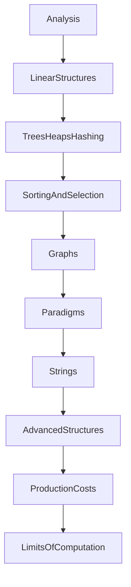

# Bits and Bytes curriculum

A complete study path for data structures and algorithms, written for this repository. It combines the topic map of the standard textbooks and university courses with the structures and costs that show up in production Python and in current engineering interviews. This file is the plan. It does not add implementations.

Read [README.md](README.md) for what is already in the tree, in the order those modules should be studied. Come back here to see which chapter that module belongs to, and what is still missing.

Status words used below:

* **Present** means a module exists and its `Cost` section derives the bound.
* **Partial** means the idea is started, and a named piece of the classic treatment is still absent.
* **Missing** means a learner cannot study it from this repository yet.

## What "complete" means here

Complete, for this course, means a learner can do four things without leaving the repository:

1. Implement the structure or algorithm from the docstring and a worked trace.
2. Derive the time and extra memory the way the existing `Cost` sections do: name the input size, count the loops, multiply by the work in the body, and separate extra memory from the input.
3. Say which textbook result or production system the code is a small version of.
4. Name the next structure a professional would reach for when the teaching version is the wrong tool, without implementing that production system inside this course.

The course stops short of a second degree. Numerical linear algebra, the FFT, linear programming, cryptography, and a full machine-learning course are named in the last section so they are not mistaken for gaps in the data-structure sequence. System design (capacity planning, replication, product APIs) is not this course. The data structures those designs sit on are.

## Sources

The sequence is a synthesis, not a copy of one syllabus.

| Source | What it contributes |
| --- | --- |
| Cormen, Leiserson, Rivest, Stein, *Introduction to Algorithms*, 4th ed., MIT Press, 2022 | The lasting map: foundations, sorting and order statistics, elementary and balanced trees, hashing, dynamic programming, greedy algorithms, amortization, union-find, graphs through matching, and the 4th-edition additions (online algorithms, bipartite matching). New chapters there on parallel algorithms and machine learning are listed as adjacent fields, not as coding modules. |
| MIT 6.006, Spring 2020 (OpenCourseWare; the subject is now numbered 6.1210) | The undergraduate core in one term: dynamic arrays and hashing, sorting including linear-time sorting, AVL trees, binary heaps, BFS, DFS, Bellman-Ford, Dijkstra, dynamic programming, and a first lecture on complexity. |
| Princeton COS 226, Spring 2026, and Sedgewick & Wayne, *Algorithms*, 4th ed., 2011 | What is "in use on computers today": union-find, symbol tables, red-black trees, hashing by chaining and linear probing, minimum spanning trees, shortest paths, string sorts, tries, substring search, and data compression. The Coursera form of the same book adds the concrete algorithm list used in the chapters below. |
| UC Berkeley CS 61B, Fall 2025 (Hug and Kao) | Implementation discipline: asymptotics before cleverness, disjoint sets, 2-3 and left-leaning red-black trees, tries, the comparison-sort lower bound, and radix sort. The course also treats testing and ADTs as part of learning a structure. |
| Python language documentation, "Time complexity of operations on built-in types" (current 3.x docs) | The costs of `list`, `dict`, `set`, and the advice to use `collections.deque` when both ends move. Those bounds are what the industry chapters have to match. |
| Engineering interviews, 2024–2026 | The patterns that recur once the structures exist: two pointers, sliding window, binary search on a sorted range and on the answer, tree and graph traversal, topological sort, union-find, heaps, prefix sums, and backtracking. Coding is one part of a hiring loop, not the whole job. The same years added production vocabulary this course should teach at recognition level: B-trees and LSM-trees in storage engines, approximate membership (Bloom filters), and nearest-neighbor indexes over embeddings. |

When two sources disagree about which balanced tree to code, this course codes one (a 2-3 tree or a left-leaning red-black tree) and names the other. When they disagree about Dijkstra, the course replaces the current O(V²) scan with a binary heap, and keeps the scan in the docstring as the slower version it improves on.

## How each future module should be written

Match the modules that are already Present:

* A module docstring states the idea, the invariant, and one worked trace with the pointer or stack written out.
* Every function has a `Cost` section that derives the bound.
* Tests cover the empty case, a one-element case, and one case that distinguishes the algorithm from a nearby one (stability, a negative edge, a duplicate key, a cycle).
* The README stays an index of results. The algebra stays in the docstring.
* Package paths stay importable. New families get a package (`graphs/`, `strings/`, `dynamic_programming/`), not a numbered filename.

## Study order

Chapters 1 through 4 overlap the current README. Later chapters are the upgrade.

---

## 0. How to study this repository

**Present**, as a convention rather than a module.

* Read the README section, then the module docstring, then the `Cost` section, then the tests.
* Re-derive one bound on paper before reading it: bubble sort's `n(n - 1) / 2`, or the claim that a monotonic stack is O(n) because each index is pushed and popped once.
* Keep a note of peak extra memory versus the memory of the result. Several list algorithms are O(1) after `require_linear` returns, and O(n) while that guard holds its `seen` set.

---

## 1. Analysis

The textbooks all start here (CLRS parts I; MIT lecture 1; CS 61B asymptotics). This repository currently teaches analysis only inside individual `Cost` sections. A short foundations module should make the vocabulary shared.

| Topic | Teach | Status |
| --- | --- | --- |
| A model of a step | A pointer write, a comparison, a hash, and an arithmetic operation are the steps we count. Python bytecode and cache misses are acknowledged later, not in the first bound. | Missing as its own note |
| O, Θ, Ω | Upper bound, tight bound, lower bound. Use Θ when the `Cost` section has a sum such as `n(n - 1) / 2`. | Used in docstrings, never defined |
| Best, typical, worst | Already the house style when they differ (insertion sort, quick sort, hash tables). | Present as a habit |
| Recurrences | Master theorem cases a learner will meet: `T(n) = 2T(n/2) + O(n)` for merge sort, `T(n) = T(n/2) + O(1)` for binary search, `T(n) = T(n - 1) + O(n)` for Lomuto on equals. Substitution and a recursion tree are enough; Akra–Bazzi is out of scope. | Partial, inside merge sort and quick sort |
| Amortized cost | Aggregate analysis first (n dynamic-array doublings cost O(n) copies). Potential method is a later note, used for splay trees and dynamic tables if those are added. | Partial, on `list.append` via `Stack.push` |
| Randomized expectation | A random pivot's expected O(n log n), and why all-equal Lomuto stays O(n²). | Partial, in `quick_sort.py` |
| Loop invariants | One sentence per algorithm, already requested for Floyd, the histogram stack, and shunting-yard. Extend the habit. | Partial |

**Industry hook.** Production incidents that are "the algorithm is quadratic" start from this chapter: an `in` test on a list inside a loop, a `list.pop(0)` used as a queue, a hash table whose keys all collide.

**Suggested module.** `bitsandbytes/analysis.py` is the wrong shape. Prefer `docs` staying out of the package, and a single `bitsandbytes/complexity.py` that is only the vocabulary docstring plus two tiny functions: an instrumented counter a test can use, and a master-theorem classifier for the three recurrences above. The classifier is a study aid, not a solver for arbitrary recurrences.

---

## 2. Linear structures

CLRS chapter 10 and CS 61B's list sequence. Most of this chapter exists.

| Topic | Cost to derive | Status | Where |
| --- | --- | --- | --- |
| Singly linked list, cached tail | `append` O(1); `node_at` and tail `pop` O(n) | Present | `linked_list.py` |
| List algorithms: reverse, pairs, blocks, middle, Floyd, nth-from-end, duplicates, rotate, partition, odd-even, reorder, palindrome, delete-without-predecessor, add-two-numbers, merge, intersection, bottom-up list merge sort, circular split, modular nodes, reviewers | As in the README | Present | `linked_lists/` |
| Doubly linked list | Unlink given the node is O(1) | Present | `doubly_linked_list.py` |
| Stack, bounded and unbounded | Amortized O(1) `push`; O(1) `pop` | Present | `stacks/stack.py`, `algorithm_stack.py` |
| Stack applications: brackets, min stack, next greater, stock span, histogram, shunting-yard, sort with one extra stack | O(n) monotonic scans; O(n²) stack sort | Present | `stacks/` |
| Queue on a doubly linked list | O(1) enqueue and dequeue | Present | `queues/linked_queue.py` |
| Circular buffer and the full-versus-empty ambiguity | O(1) with an explicit size | Present | `queues/circular_queue.py` |
| Deque as the structure behind `collections.deque` | O(1) at both ends; O(n) in the middle | Missing | Build it on the doubly linked list, then state that CPython uses a block of arrays for locality |
| Dynamic array, separate from "Python list" | Geometric growth: n appends are O(n) copies in total | Partial | Told inside `Stack.push`; there is no standalone `DynamicArray` |
| Recursion, call stack, tail calls | Python does not optimize tail calls; recursive reverse is O(n) stack | Present as the reverse pair | `linked_lists/reverse.py` |

**Do not add** another dozen linked-list puzzles. The pattern set in chapter 2 is enough. New list problems in later chapters should reuse `LinkedList`.

---

## 3. Trees, heaps, and hashing

MIT lectures 4 and 6–8, CLRS chapters 11–13 and 6, Princeton symbol tables, Berkeley 2-3 trees and hashing.

| Topic | Cost to derive | Status | Notes |
| --- | --- | --- | --- |
| Binary tree traversals: preorder, inorder, postorder, level order | O(n) time; O(h) stack or O(n) queue | Partial | Inorder exists on the BST. The other three, on a plain binary tree, are missing. Level order is the queue chapter applied to a tree. |
| Binary search tree | O(h) search and insert; sorted insertion is h = n | Present | `trees/bst.py` has insert, contains, and iterative inorder. Deletion is missing, and deletion is where BSTs get their cases (two children, successor). |
| Balanced search tree, one of AVL, 2-3, or left-leaning red-black | O(log n) height after every insert and delete | Missing | Code one. Name the others. Red-black is what `TreeMap` in Java and typical library trees resemble; 2-3 is the clearer invariant. |
| Augmenting a tree | Order-statistic tree: rank and select in O(log n) once subtree sizes are stored | Missing | CLRS's point is the method, not a second species of tree. One augmented BST is enough. |
| Binary heap | `heapify` O(n) because the sum of heights is linear; push and pop O(log n) | Partial | `heaps/heapsort.py` sifts down. There is no priority queue with `push`, `pop`, and `peek`. `decrease-key` waits until Dijkstra needs it, and an index map is the honest way to get O(log n) rather than a linear scan. |
| Heapsort | O(n log n) time, O(1) extra memory, not stable | Present | `heapsort` |
| Separate-chaining hash table | Expected O(1) lookup; O(n) rehash when the table doubles | Present | `hash_tables/chaining.py` |
| Open addressing | Linear probing: expected O(1) under a load factor bounded away from 1; clustering is the story | Missing | Princeton teaches it beside chaining. Tombstones on delete are the bug to document. |
| Hash quality | A hash that sends every key to one bucket makes the expected bound false. Python's `dict` assumes a well-distributed hash and records worst-case O(n) in the language docs. | Missing as a note on the chaining table | Do not invent a cryptographic hash. Show one bad hash and the resulting chain length. |

**Industry hook.** Language dictionaries, database indexes, and caches are this chapter. An LRU cache (already Present) is a hash table plus an order list. Say that explicitly when the hash chapter is reread.

---

## 4. Sorting and selection

CLRS part II, MIT lectures 3 and 5, Berkeley's sorting block, Princeton's quicksort and mergesort.

| Topic | Cost to derive | Status |
| --- | --- | --- |
| Bubble, selection, insertion | Quadratic comparison sorts; insertion is O(n) on sorted input; bubble and insertion are stable | Present |
| Merge sort | `T(n) = 2T(n/2) + O(n) = O(n log n)`; O(n) extra memory; stable | Present, on arrays and on linked lists |
| Quick sort, Lomuto, and three-way partition | Expected O(n log n) on distinct keys; Lomuto on all-equal keys is O(n²); three-way split repairs that | Present |
| Heapsort | See chapter 3 | Present |
| Comparison lower bound | `log2(n!)` is about `n log n` comparisons, so a comparison sort cannot beat that in the worst case | Missing |
| Counting sort, radix sort | O(n + k) and O(d(n + k)) when keys are integers in a range. Not comparison sorts, so the lower bound does not apply | Missing |
| Quickselect / median of medians | Expected O(n) selection; worst-case linear selection is the CLRS result worth stating even if the constant-factor version is only sketched | Missing |
| Binary search, lower bound, upper bound | `T(n) = T(n/2) + O(1) = O(log n)` | Present |
| Binary search on the answer | The search space is a numeric range, not an array index. Each probe is a monotonic predicate | Missing |
| Stability and adaptivity | Which sorts keep equal keys in order, and which get faster on nearly sorted input | Partial | Tested for bubble, insertion, and merge. Selection and quick sort are documented as not stable. |

**Industry hook.** Database `ORDER BY` is rarely a hand-written quick sort. The lesson is to know when the library Timsort (Python's `list.sort`, a stable adaptive merge sort) is the right call, and when an integer radix or a selection algorithm avoids sorting the whole input.

---

## 5. Graphs

MIT lectures 9–14, CLRS part VI, Princeton's graph half. The current package is an adjacency list, DFS, BFS, and a Dijkstra that scans unsettled vertices.

| Topic | Cost to derive | Status |
| --- | --- | --- |
| Representations | Adjacency lists O(V + E) space; a matrix is O(V²) and answers "is there an edge?" in O(1). Lists are the default in this course. | Partial | Lists exist. The matrix is a paragraph, not a type. |
| BFS and DFS | O(V + E) | Present | `breadth_first_order`, `depth_first_order` |
| BFS distances on an unweighted graph | The queue order is the shortest-path order | Missing | The current BFS returns an order, not distances or parents |
| Cycle detection, topological sort | A DAG has a finishing-time order; a back edge means a cycle. O(V + E) | Missing | This is the scheduling algorithm interviews and build systems both use |
| Connected components, and strongly connected components | Kosaraju or Tarjan, O(V + E). Teach one. | Missing |
| Undirected versus directed | The same code with a different edge rule will silently answer the wrong question | Missing as an explicit pair of classes or a flag |
| Weighted edges | Already on `Graph.add_edge` | Present |
| Dijkstra with a binary heap | O((V + E) log V) with a heap, for non-negative weights. The current scan is O(V² + E) and should remain in the docstring as the version this replaces | Partial |
| Bellman-Ford | O(VE), detects a negative cycle. The reason Dijkstra's non-negative precondition exists | Missing |
| Shortest paths in a DAG | One topological pass, O(V + E), negative weights allowed | Missing |
| All-pairs (Floyd-Warshall) | O(V³) time, O(V²) memory. Johnson's algorithm can stay a citation | Missing |
| Minimum spanning tree | Kruskal with union-find, and Prim with a heap. Cut property in one paragraph | Missing |
| Bipartite test | BFS 2-coloring, O(V + E) | Missing |
| Maximum flow and bipartite matching | Ford-Fulkerson is the classic capstone. Teach the idea and Edmonds-Karp's O(VE²) bound. A full library of flow algorithms is out of scope | Missing |
| 0-1 BFS | A deque instead of a heap when weights are only 0 and 1 | Missing | Small, and it ties the deque chapter to graphs |

**Industry hook.** Dependency graphs, web crawls, routing, and "is this user connected to that user?" are BFS, DFS, topological sort, and union-find. Matching and flow are the tools behind assignment problems; most product code calls a solver rather than hand-rolling Ford-Fulkerson.

---

## 6. Design paradigms

MIT's dynamic-programming block and CLRS chapters 14–16. These are techniques, so each module is a pair: the technique's invariant, then two or three problems that exist only to force that invariant. Do not collect a problem archive.

### 6.1 Divide and conquer

**Partial.** Merge sort, quick sort, and binary search are the examples. Add the master theorem note from chapter 1, and one problem that is not a sort: closest pair is optional; an inversion count during merge is the right size for this repository because it reuses merge sort.

### 6.2 Dynamic programming

**Missing.** Teach the checklist MIT uses: subproblems, a recurrence, a topological order of the subproblems (often just increasing length or a DAG), and the difference between memoized recursion and a bottom-up table.

Implement, with derived costs:

| Problem | Bound to derive | Why it is here |
| --- | --- | --- |
| Fibonacci, naive versus memoized versus bottom-up | Exponential versus O(n) | The definition of overlapping subproblems |
| Coin change (minimum coins) | O(amount × coins) time, O(amount) memory | The first table people can fill by hand |
| 0/1 knapsack | O(nW) time, and the one-row O(W) memory optimization | Pseudo-polynomial time, named as such |
| Longest common subsequence | O(nm) time and memory | The grid recurrence |
| Edit distance | O(nm), same grid, different local choice | Diff tools and spell correction |
| Longest increasing subsequence | O(n²) and the O(n log n) patience-sorting form | Shows a DP that a search structure improves |
| House robber / linear DP | O(n) | The smallest "adjacent constraint" |
| Word break or unbounded knapsack | O(n · dictionary) or O(nW) | Reuses the coin pattern |
| DP on a DAG | O(V + E) after a topological sort | Connects this chapter to chapter 5 |

Interval DP (matrix-chain order, burst balloons) is a second pass, one example only. Digit DP, tree DP, and bitmask DP are named as extensions, not required modules.

### 6.3 Greedy algorithms

**Missing.** The lesson is the exchange argument or the matroid intuition in one paragraph, plus a counterexample where the greedy choice fails.

Implement:

| Problem | Bound | Proof obligation in the docstring |
| --- | --- | --- |
| Interval scheduling | O(n log n) after sorting by finish time | A greedy choice stays optimal |
| Fractional knapsack | O(n log n) | Contrast with 0/1 knapsack, where this choice fails |
| Huffman coding | O(n log n) with a heap | Connects heaps to compression, which Princeton teaches |
| Dijkstra and Prim | Already placed in chapter 5 | They are greedy; say so when those modules are written |

### 6.4 Backtracking

**Missing.** Permutations, combinations, subsets, and one constraint problem (N-queens or sudoku). Derive the size of the recursion tree rather than pretending it is polynomial. Pruning is part of the cost story: the worst-case tree does not shrink just because a test rejects early on some inputs.

### 6.5 Two pointers, sliding window, and prefix sums

**Partial.** Fast/slow pointers, the nth-from-end gap, and three-way partition are the structural versions. The array versions are missing and are the ones interviews mean by these names.

| Pattern | Bound | Status |
| --- | --- | --- |
| Two pointers on a sorted array (pair sum, container with most water) | O(n) after the array is sorted | Missing |
| Sliding window with a monotonic predicate or a frequency map | O(n) because each index enters and leaves once | Missing |
| Prefix sums, including a difference array | O(n) build, O(1) range sum | Missing |
| Monotonic queue for sliding-window maximum | O(n), the histogram stack's cousin | Missing |

---

## 7. Strings

Princeton's second half and CLRS chapter 32. Nothing in the repository is a string algorithm yet, except that bracket matching scans a string.

| Topic | Cost to derive | Status |
| --- | --- | --- |
| Trie | O(total characters) to build; O(length of the query) to look up, independent of how many keys share no prefix | Missing |
| Ternary search trie | Princeton's space-conscious alternative. Teach as a note beside the trie, or as a second type if the first one is solid | Missing |
| Longest common prefix queries | The reason a trie beats a sorted list of strings plus binary search | Missing |
| Knuth-Morris-Pratt | O(n + m) after the failure function, which is itself O(m) | Missing |
| Rabin-Karp | Expected O(n + m) with a rolling hash; a bad hash collides | Missing |
| Boyer-Moore | Often faster in practice because of the skip; the simplified bad-character rule is enough | Missing as a note if KMP and Rabin-Karp are coded |
| Run-length encoding and Huffman | Huffman is chapter 6. Run-length encoding is the O(n) warmup | Missing |
| Suffix arrays | CLRS 4th edition added them. One construction that is O(n log n) by sorting suffixes, plus LCP, is the right depth. Linear-time construction (SA-IS) is a citation | Missing |
| Regular expressions to NFAs | Princeton's closing topic. Optional. If included, it is Thompson's construction, not a PCRE clone | Optional |

**Industry hook.** Autocomplete, routers, and search boxes are tries. `grep` and editor search are string matching. Compression is Huffman plus a model. Full-text search engines use inverted indexes (a hash or sorted postings list), which should be one short module: build O(total tokens), query O(postings of the term).

---

## 8. Advanced structures

CLRS part V, plus the structures working engineers meet after the undergraduate core. Each one earns a place by changing a bound the earlier chapters could not.

| Topic | Bound that justifies it | Status | Depth |
| --- | --- | --- | --- |
| Union-find | Inverse Ackermann, treated as "effectively constant" per operation, with path compression and union by rank. Without those, the bound is worse and the code should show it | Missing | Implement. Kruskal and percolation are the two clients |
| B-tree | O(log_B n) height with branching factor B, which is the disk-page or SSD-page parameter | Missing | Implement a small B-tree in memory. The page story is the docstring, not a disk driver |
| Skip list | Expected O(log n) search, insert, delete, with randomized levels. This is a real alternative to a balanced tree (Redis's sorted sets are a well-known user) | Missing | Implement |
| Segment tree, and a Fenwick tree | O(log n) point update and range query. Fenwick is shorter and handles prefix sums; the segment tree handles more general combinations | Missing | Implement both. Lazy propagation is the second lesson on the segment tree, one operation (range add) |
| Sparse table | O(n log n) build, O(1) idempotent range query, no updates | Missing | One range-minimum module |
| Bloom filter | O(k) per insert and query, false positives, no false negatives, no deletes in the basic form | Missing | Implement. Counting Bloom filters are a note |
| Count-Min sketch and HyperLogLog | Approximate frequency and approximate cardinality in sublinear memory | Missing | One of them, not both, unless the first one is small. The lesson is the error guarantee |
| LRU and LFU | LRU is Present. LFU with O(1) operations (frequency buckets) is the follow-up | Partial | `linked_lists/lru_cache.py` |
| Splay tree | Amortized O(log n), self-adjusting. Optional once a balanced tree exists | Missing | Optional |
| Persistent stack or list | Old versions remain, O(1) per update for a stack, path copying O(log n) for a tree | Missing | One persistent stack. It explains snapshots without a lecture on purely functional data structures |
| Disjoint sparse table, heavy-light decomposition, link-cut trees | Competitive-programming machinery | Out of scope | Name them so the segment tree does not pretend to be the last word |

---

## 9. Production costs and contemporary practice

This chapter is the difference between a textbook course and a course for people who ship Python. It should be code where a small model is honest, and prose where a distributed system would be a pretense.

### 9.1 The standard library, with the official bounds

**Missing** as a single study note tied to the Python docs. The implementations in earlier chapters exist so these lines mean something.

| Object | Fact to teach | Source |
| --- | --- | --- |
| `list` | `append` and `pop()` at the end are amortized O(1). `insert(0, x)` and `pop(0)` are O(n). Indexing is O(1). | Python "Time complexity" documentation |
| `collections.deque` | O(1) at both ends. The right queue for BFS. CPython stores it as blocks, not one node per element | Same, plus the collections docs |
| `dict` and `set` | Average O(1) lookup, insert, and delete if hashes spread out. Worst case O(n) when they do not. Since 3.7, `dict` preserves insertion order | Language docs |
| `heapq` | Min-heap only. `heappush` and `heappop` are O(log n). `heapify` is O(n). A max-heap is negation, or a wrapper | `heapq` docs |
| `bisect` | Binary search on a sorted `list`, O(log n) | `bisect` docs |
| `list.sort` | Timsort, O(n log n), stable, adaptive on partially sorted runs | Implementation note worth one paragraph |

A module `bitsandbytes/library_costs.py` should not reimplement CPython. It should be a short, tested guide: functions that *use* `deque`, `heapq`, and `bisect` for BFS, top-k, and a sorted insert, each with a `Cost` section that cites the library operation they rely on.

### 9.2 Locality

**Missing.** A linked list of nodes and a dynamic array of the same values do the same abstract operations at different constant factors, because of cache lines. The course should say this next to `DynamicArray` and the deque, with a small benchmark that is allowed to be noisy and is not a proof. The proof stays the operation count. The benchmark is the reason the array wins on a scan.

### 9.3 Storage engines

**Missing**, at recognition depth plus one coded analogue.

| Idea | What to say | What to code |
| --- | --- | --- |
| B-tree versus LSM-tree | B-trees mutate pages in place (classic databases). LSM-trees append runs and merge them (many current key-value stores). Writes love LSMs; point reads pay for multiple runs unless a filter helps | The in-memory B-tree from chapter 8. An LSM is a docstring and a tiny in-memory version: a memtable (the balanced tree or skip list) plus sorted runs merged like merge sort |
| Write-ahead log | Durability is a sequential append before the in-memory structure is considered committed | A dozen-line log that replays into the memtable. Not a crash-safe database |
| Bloom filter in front of a run | The filter from chapter 8, used so a read can skip a run | Wire the filter to the toy LSM |

### 9.4 Caches and approximate membership

LRU is Present. Add the Bloom filter (chapter 8) and one sentence on single-flight and TTL: those are policies around a cache, not new asymptotic structures. LFU is optional.

### 9.5 Concurrency, only the vocabulary

**Do not** build a lock-free hash table in this course. Do write a page that states:

* A structure that is correct for one thread is not thereby correct for two.
* A mutex around the public methods is the coarse version, and it serializes the O(1) operation.
* Readers-writer locks, concurrent hash maps, and lock-free stacks exist; their correctness arguments are memory-model arguments, which are a different course.
* Immutability and the persistent stack from chapter 8 are one way to share a snapshot without a lock.

### 9.6 Nearest-neighbor search

**Missing**, recognition plus a brute-force module.

Exact nearest neighbor in a list of vectors is O(nd) for n vectors of dimension d. That module belongs here because the contemporary demand (embedding search) starts from that bound. Approximate indexes (HNSW, IVF) exist to avoid it. Describe HNSW as a graph where search is greedy over long-range and short-range edges, and stop. Implementing a production ANN index is not required for "complete" coverage of classical DSA, and a naive one would teach the wrong constants.

### 9.7 What interviews add, without turning the repo into a problem bank

After chapters 2 through 7, a learner should be able to recognize these patterns and point at a module. A single `exercises/` set, maybe twenty problems, is in scope if each problem is one pattern and names the module it drills. Hundreds of unrelated problems are out of scope.

The patterns, in the order to drill them: hash map, two pointers, sliding window, stack, binary search, binary search on the answer, linked list, tree traversal, heap / top-k, prefix sums, backtracking, graph traversal, topological sort, union-find, dynamic programming, intervals. That list matches the patterns that public write-ups of 2024–2026 hiring loops keep repeating. It is not a claim about any one company's process.

---

## 10. Limits, named so the course can end

MIT's last content lecture and CLRS chapters 34 and 35. This is not a complexity-theory course. It is the chapter that stops a learner from hunting for an O(n log n) algorithm that the problem statement does not allow.

| Topic | Depth |
| --- | --- |
| P and NP, as decision problems | Definitions and five canonical problems: SAT, clique, vertex cover, Hamiltonian path, subset sum. No proof of the Cook-Levin theorem |
| NP-complete, in one paragraph | A polynomial reduction. One worked reduction that is small (vertex cover and independent set, or subset sum and knapsack's decision version) |
| How to respond | Exact exponential with a clear bound, dynamic programming when a pseudo-polynomial bound exists, approximation when the problem is an optimization version, or a solver |
| Approximation | One algorithm: a 2-approximation for vertex cover, or the greedy set-cover `H_n` bound. Derive the ratio |
| Online algorithms | CLRS 4th edition's chapter. Ski rental or paging, one competitive ratio, because caches in chapter 9 are online |
| Parallel algorithms | A note that work and span replace the single-thread recurrence (`T` infinity is the span). No CUDA |

---

## Adjacent fields this course will not absorb

Listed so a later pass does not quietly expand without a decision.

| Field | Why it is adjacent |
| --- | --- |
| Machine learning algorithms (CLRS chapter 33) and ML system design | Gradient methods, feature stores, and model serving are a pipeline course. The indexes and caches underneath them are chapters 8 and 9 |
| Computational geometry | Convex hull (Graham scan) is the one algorithm worth a module if geometry is ever added. Not required for completeness of the core |
| Number theory | GCD and modular exponentiation are short and useful. RSA is a different course |
| Linear programming, FFT, matrix multiplication | CLRS selected topics. Cite them when a recurrence or a matching problem would really be solved by one of these |
| Distributed systems | Consensus, sharding, and replication use the logs and trees in chapter 9. The protocols themselves are not DSA modules |

---

## Gap list

Everything below is Missing or Partial. The order is the order to build it, because later rows use earlier ones.

| Order | Work | Depends on |
| --- | --- | --- |
| 1 | Analysis note: O/Θ/Ω, three recurrences, amortized doubling | Nothing |
| 2 | `DynamicArray` and a deque | Linked list, doubling argument |
| 3 | BST deletion; plain binary-tree traversals including level order | Queue, BST |
| 4 | Priority queue on the binary heap, then Dijkstra with that heap | Heap, graph |
| 5 | One balanced search tree | BST |
| 6 | Comparison lower bound; counting sort and radix sort; quickselect | Sorts, binary search |
| 7 | Open addressing and one pathological hash | Chaining table |
| 8 | Graph parents and distances, topological sort, components, Bellman-Ford, a DAG shortest path, MST (Kruskal and Prim), bipartite test | Heap, and union-find for Kruskal |
| 9 | Union-find with the two heuristics | Nothing structural, but Kruskal wants it |
| 10 | Dynamic programming module: the eight problems in section 6.2 | Recursion, arrays |
| 11 | Greedy module: intervals, fractional knapsack, Huffman | Heap, sort |
| 12 | Backtracking, two pointers, sliding window, prefix sums | Arrays, hash table |
| 13 | Trie, KMP, Rabin-Karp, inverted index | Hashing, strings |
| 14 | Segment tree, Fenwick tree, sparse table | Arrays |
| 15 | B-tree, skip list, Bloom filter, toy LSM | Balanced tree or skip list, Bloom filter |
| 16 | Library-cost module for `deque`, `heapq`, `bisect`, Timsort | Chapters 2–4 |
| 17 | Floyd-Warshall, flow at recognition depth, NP and one approximation, one online algorithm | Graphs, chapter 10 |

Chapters 2's linked-list puzzles, the five quadratic-or-better sorts already in the tree, the stack lessons, binary search, chaining, and the teaching Dijkstra stay. They are not gaps. Dijkstra is a gap only in the heap-based bound.

## How progress should be recorded

When a row in the gap list becomes code:

* The module's `Cost` section is the definition of done, together with tests for the empty, singleton, and distinguishing cases.
* The README gains one bullet: file, idea, cost result.
* This file's status cell changes from Missing to Present, and the worked-trace requirement is either met in the module docstring or the status stays Partial.

The curriculum file remains the map. It should not grow a second copy of the algebra.
