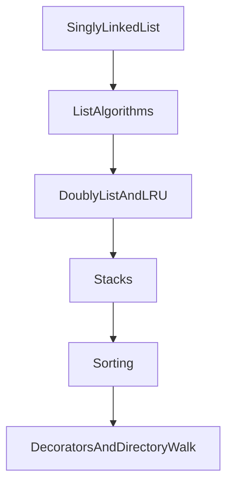

# Bits and Bytes

A study path for the data structures in this repository. Read the sections in order. Every function and method has a `Cost` section in its docstring that names the input size, counts the loops, and separates extra memory from the input. The notes below record only the result of that derivation.



## 1. Singly linked list

* `bitsandbytes/linked_list.py` — one `Node` chain with a cached tail and a cached length. `append`, `prepend`, and `len` are O(1). `node_at`, `insert`, and `insert_sorted` are O(n). `pop` of the tail is O(n) because the predecessor is not stored. `refresh` and `require_linear` are O(n) time and O(n) extra memory.

## 2. List algorithms

These modules only rewrite `next` on that shared list.

* `linked_lists/reverse.py` — iterative reversal is O(n) time and O(1) extra memory. The recursive form is the same time and O(n) call-stack memory.
* `linked_lists/reverse_in_pairs.py` — swap neighbours. O(n) time, O(1) extra memory.
* `linked_lists/reverse_in_blocks.py` — reverse every block of `k`. Each node is touched a constant number of times, so time is O(n), not O(n·k). Extra memory is O(1).
* `linked_lists/cycle.py` — Floyd's two pointers find whether a cycle exists and where it starts. O(n) time, O(1) extra memory.
* `linked_lists/remove_cycle.py` — clear the one link that points back at the cycle entrance. O(n) time, O(1) extra memory.
* `linked_lists/middle.py` — a fast pointer covers the list while a slow pointer stops halfway. O(n) time, O(1) extra memory. `middle_node` is the later middle on an even length; `end_of_first_half` is the earlier one.
* `linked_lists/nth_from_end.py` — a fixed gap of `n` nodes, then one walk together. O(length) time, O(1) extra memory, including removal.
* `linked_lists/duplicates.py` — sorted duplicates are removed with only the successor, O(n) time and O(1) extra memory. Unsorted duplicates use a set: expected O(n) time and O(n) extra memory.
* `linked_lists/rotate.py` — close the chain, cut the new tail, open it. O(n) time, O(1) extra memory.
* `linked_lists/partition.py` — values below the pivot, then the rest, original order kept inside each group. O(n) time, O(1) extra memory.
* `linked_lists/odd_even.py` — odd positions in front of even positions. O(n) time, O(1) extra memory.
* `linked_lists/reorder.py` — split at the left middle, reverse the right half, zip. O(n) time, O(1) extra memory.
* `linked_lists/palindrome.py` — the same split and reverse, then compare the halves. O(n) time, O(1) extra memory.
* `linked_lists/delete_node.py` — copy the successor into the node you hold, then drop the successor. O(1). This cannot delete the tail.
* `linked_lists/add_numbers.py` — least-significant digit at the head, so the carry walk starts there. O(n + m) time, O(1) scratch besides the result nodes.
* `linked_lists/merge_sorted.py` — merge two sorted chains by relinking nodes. O(n + m) time, O(1) extra memory.
* `linked_lists/intersection.py` — equalize the lengths, then walk in step until the shared node. O(n + m) time, O(1) extra memory.
* `linked_lists/sort_list.py` — bottom-up merge sort. `log2(n)` passes of O(n) merging, so O(n log n) time and O(1) extra memory. Stable.
* `linked_lists/split_circular.py` — split one circular list into two. O(n) time, O(1) extra memory besides the second list object.
* `linked_lists/modular_nodes.py` — every k-th node from the start is O(n) time. From the end, the version here stores the nodes, so extra memory is O(n).
* `linked_lists/reviewers.py` — a circular review rotation. Inserting after the cursor and advancing it are both O(1).

## 3. Doubly linked list and the LRU cache

* `bitsandbytes/doubly_linked_list.py` — `prev` makes unlink and insert-beside-a-node O(1). Reversal is O(n) time and O(1) extra memory. A singly linked list pays O(n) to find the predecessor first.
* `linked_lists/random_pointer.py` — clone a node that also has an arbitrary `random` link. The dictionary clone is expected O(n) time and O(n) extra memory. The interleaved clone is O(n) time and O(1) scratch besides the copy itself.
* `linked_lists/lru_cache.py` — a dictionary finds the key's node and the doubly linked list orders nodes by use. `get` and `put` are expected O(1). Resident memory is O(capacity).

## 4. Stacks

* `stacks/stack.py` — a bounded stack on the end of a Python list. `push` is amortized O(1). `pop` and `peek` are O(1). A single resize copy is O(n).
* `stacks/symbol_balance.py` — one pass over the characters. Time is O(n). The stack holds at most n unmatched openers.
* `stacks/min_stack.py` — a second stack of minima. `push`, `pop`, and `minimum` are all O(1).
* `stacks/next_greater.py` — monotonic stack. Each index is pushed and popped at most once, so n items are O(n), not O(n²).
* `stacks/stock_span.py` — the same monotonic pattern. The span is the run of consecutive earlier prices that are still `<=` today. O(n) time.
* `stacks/largest_rectangle.py` — largest rectangle in a histogram, one monotonic pass. O(n) time.
* `stacks/infix_postfix.py` — shunting yard, then evaluate the postfix. Each token is handled once: O(n).
* `stacks/sort_stack.py` — sort with one extra stack. Worst case each insertion scans the extra stack: O(n²) time, O(n) extra memory. Already-ordered input is O(n).

## 5. Sorting

All five sorts compare with `<`. The first three and quick sort rearrange the input list. Merge sort returns a new list.

* `sorting/bubble_sort.py` — adjacent swaps. Worst and average time O(n²). A sorted list stops after one pass: O(n). Extra memory O(1). Stable.
* `sorting/selection_sort.py` — one swap per position after the scan. Time is O(n²) for every input order. Extra memory O(1). Not stable.
* `sorting/insertion_sort.py` — shift a hole through the sorted prefix. Worst and average time O(n²). Already sorted input is O(n). Extra memory O(1). Stable.
* `sorting/merge_sort.py` — `T(n) = 2 T(n/2) + O(n)`, which is O(n log n) for every input. Extra memory O(n). Stable.
* `sorting/quick_sort.py` — random pivot, Lomuto partition. Expected time O(n log n). Worst case O(n²). Expected extra memory O(log n) for the call stack, O(n) in the worst split. Not stable.

## 6. Decorators and the directory walk

* `decorators/permission.py` — the wrapper asks once, then either returns or calls the wrapped function. The wrapper is O(1) plus that call.
* `decorators/access_control.py` — the wrapper looks the current user up in a permission table, an expected O(1) check, then calls the action or raises `PermissionError`.
* `tools/print_directory.py` — `os.walk` visits each directory and each file once. Time and the output string are O(entries).

`print_directory_paths.py` still runs the directory walk.

## Try it

```bash
python -m bitsandbytes.tools.print_directory topdown
python -m bitsandbytes.decorators.permission
python -m bitsandbytes.decorators.access_control developer testdb
```

## Tests

```bash
python -m pip install pytest
pytest
```
